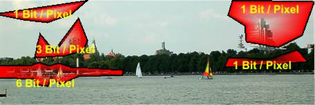
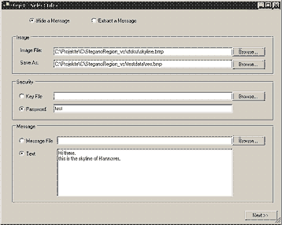
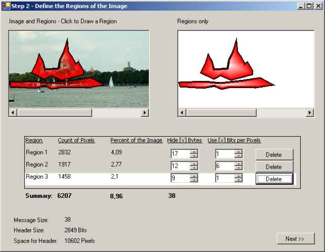
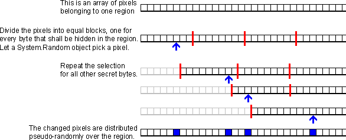
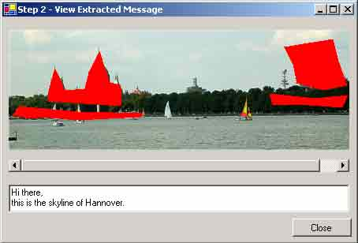
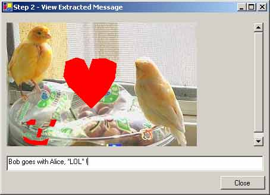

# {{ page.title }}

 [C# Quellcode - 31.7 Kb]()

## Worum geht es?

Eine bekannte Form der Steganoanalyse besteht darin, eint&ouml;nige Bereiche des Bildes nach Variationen abzusuchen.
In diffusen Bereichen, in denen jedes Pixel eine ganz andere Farbe hat als seine Nachbarn, sind ver&auml;nderte Bits schwer
auszumachen. Aber die meisten Bilder enthalten auch glatte Farben.
Verschwende mal einen Blick auf dieses hier:

<ul>
<li>Der blaue Himmel in der oberen Mitte sollte keine versteckten Daten enthalten, da dort nahezu keine nat&uuml;rlichen Variationen vorkommen.</li>
<li>Die Wolken haben mehr Blauschattierungen, aber alles nicht Blaue w&auml;re leicht zu finden. Wenn &uuml;berhaupt Daten in den Wolken versteckt werden m&uuml;ssen, sollte nicht mehr als ein Bit pro Pixel ver&auml;ndert werden.</li>
<li>Das gleiche trifft auf die B&auml;me auf der rechten Seite zu: &Auml;nderungen an den h&ouml;heren Bits w&uuml;rden helle Farben ergeben, obwohl hier nur dunkle Pixel erlaubt sind, also ist die Kapazit&auml;t auf ein bis zwei Bits berschr&auml;nkt.</li>
<li>Die Boote und der Strand auf der linken Seite sind schon besser. Sie enthalten Rot, Gelb, Wei&szlig;, Blau, Gr&uuml;n...
In dieser Region k&ouml;nnen wir bis zu 7 Bits pro Pixel &auml;ndern, ohne dass es auffallen wird.</li>
</ul>

Um der einfachen Variations-Analyse zu entkommen, werden wir unsere geheime Nachricht nur in diesen Regionen verstecken, mit angepasster &quot;Bitrate&quot;:

## Regionen bearbeiten und speichern

Wie in den vorherigen Beispielen brauchen wir eine Tr&auml;gerbitmap, eine geheime Nachricht, und einen Schl&uuml;ssel.

Die neue Funktion ist der <i>Regionen Editor</i>, mit dem der Benutzer Regionen und ihre Kapazit&auml;ten definieren kann.

Die einfachste Art eine Region zu zeichnen, ist auf die Eckpunkte eines Polygons zu klicken.
Also lassen wir den Benutzer aufs Bild klicken und f&uuml;gen jeden angeklickten Punkt zu einem Polygon hinzu.
Eine Region kann mit einem Doppelklick geschlossen werden, danach &ouml;ffnet der n&auml;chste Klick eine Neue:

<pre lang=cs>
private void picImage_MouseUp(object sender, MouseEventArgs e){
   if (e.Button == MouseButtons.Left){
      if (isDoubleClicked){
         //auf Doppelklick folgendes MouseUp-Ereignis ignorieren
         isDoubleClicked = false;
      }
      else{
           if (!isDrawing){
              //neues Polygon anfangen
              isDrawing = true;
              drawingPoints = new ArrayList();
              cleanImage = picImage.Image;
              bufferImage = new Bitmap(cleanImage.Width, cleanImage.Height);
           }

           AddPoint(e.X, e.Y);
      }
   }
}
</pre>

Wenn ein Polygon mit einem Doppelklick geschlossen wird, m&uuml;ssen wir sicherstellen, dass es sich nicht mit einer der schon vorhandenen Regionen &uuml;berschneidet.
Falls es ein anderes Polygon schneidet, vereinen wir die beiden Regionen. Wenn es frei steht, erstellen wir eine neue Region und f&uuml;gen sie der Liste hinzu.
<code>ctlRegions</code> ist ein <code>RegionInfoList</code>, es zeigt Statistik und Eingabefelder f&uuml;r jede Region an.

<pre lang=cs>
private void picImage_DoubleClick(object sender, EventArgs e){
   if (drawingPoints.Count > 2){
      isDrawing = false;
      isDoubleClicked = true;

      Point[] points = (Point[])drawingPoints.ToArray(typeof(Point));
      GraphicsPath path = new GraphicsPath();
      path.AddPolygon(points);

      if (!UniteWithIntersectedRegions(path, points)){
         RegionInfo info = new RegionInfo(path, points, picImage.Image.Size);
         drawnRegions.Add(info); //zu den Regionen hinzu&uuml;gen
         ctlRegions.Add(new RegionInfoListItem(info)); //auflisten
      }

      ReDrawImages(true);
   }
}
</pre>

Wenn eine weitere Region gezeichnet wurde, m&uuml;ssen wir die &quot;Landkarte&quot; und den Statistikblock aktualisieren.
<code>ReDrawImages</code> zeichnet die Regionen auf das Ausgangsbild und die Karte.
(Die Karte und der Farbverlauf sind nicht wirklich n&ouml;tig, sondern nur ein netter Effekt.)

<pre>
/// &lt;summary&gt;Das Bild mit den Regionen in [picImage],
/// und nur die Regionen in [picMap] anzeigen&lt;/summary&gt;
/// &lt;param name="updateSummary"&gt;true: anschlie&szlig;end UpdateSummary() aufrufen&lt;/param&gt;
private void ReDrawImages(bool updateSummary){
    //leere Bilder erstellen
    Image bufferImageNoBackground = new Bitmap(baseImage.Width, baseImage.Height);
    Image bufferImageWithBackground = new Bitmap(baseImage.Width, baseImage.Height);

    //Graphics holen
    Graphics graphicsWithBackground = Graphics.FromImage(bufferImageWithBackground);
    Graphics graphicsNoBackground = Graphics.FromImage(bufferImageNoBackground);

    //Hintergrund zeichnen/loeschen
    graphicsNoBackground.Clear(Color.White);
    graphicsWithBackground.DrawImage(baseImage, 0, 0, baseImage.Width, baseImage.Height);

    //alle Regionen zeichnen
    foreach (RegionInfo info in drawnRegions){

        PathGradientBrush brush = new PathGradientBrush(info.Points, WrapMode.Clamp);
        brush.CenterColor = Color.Transparent;

        if (info == selectedRegionInfo){
           //mark the region that's selected in the list
            brush.SurroundColors = new Color[1] { Color.Green };
        }else{
            brush.SurroundColors = new Color[1] { Color.Red };
        }

        //Region zeichnen
        graphicsWithBackground.DrawPolygon(new Pen(Color.Black, 4), info.Points);
        graphicsNoBackground.DrawPolygon(new Pen(Color.Black, 4), info.Points);
        graphicsWithBackground.FillRegion(brush, info.Region);
        graphicsNoBackground.FillRegion(brush, info.Region);
    }

    //aufr&auml;umen
    graphicsWithBackground.Dispose();
    graphicsNoBackground.Dispose();

    //Bilder anzeigen
    picImage.Image = bufferImageWithBackground;
    picMap.Image = bufferImageNoBackground;
    picImage.Invalidate();
    picMap.Invalidate();

    //Zahlen und Fehler aktualisieren
    if (updateSummary) { UpdateSummary(); }
}
</pre>

Die Landkarte muss in den ersten Pixeln des Bildes gespeichert werden, so dass sie vor der Nachricht ausgelesen werden kann.
Das hei&szlig;t, wir m&uuml;ssen einen Header ins Bild einbetten. Sp&auml;ter beim Auslesen m&uuml;ssen wir zuerst den Header mit den Regionen lesen, erst dann k&ouml;nnen wir die Nachricht aus diesen Regionen auslesen.
Der Header kann &uuml;ber alle Pixel von 0/0 bis zum ersten Pixel der obersten Region verteilt werden.
Wir werden nicht wissen wo die erste Region anf&auml;ngt bevor die Karte ausgelesen ist, darum muss der Index des ersten Pixels irgendeiner Region mit im Header selbst gespeichert werden.
Die Koordinaten des Pixels sind unwichtig, weil wir die Pixel als einen langen Strom behandeln werden, nicht als Zeilen und Spalten. Ein vollst&auml;ndiger Header enth&auml;lt folgende Informationen:

<ol>
    <li><code>Int32</code> Index (nicht Koordinaten!) des ersten Pixels in der ersten Region</li>
    <li><code>Int32</code> L&auml;nge der folgenden Regionsdaten</li>
    <li>
    F&uuml;r jede Region:
        <ol>
        <li><code>Int32</code> L&auml;nge (<code>Region.GetRegionData().Data.Length</code>)</li>
        <li><code>Int32</code> Kapazit&auml;t (Anzahl von Bytes, die in dieser Region versteckt werden)</li>
        <li><code>byte</code> Anzahl verwendeter Bits pro Pixel</li>
        <li><code>byte[]</code> Region (<code>Region.GetRegionData().Data</code>)</li>
        </ol>
    </li>
</ol>

Die L&auml;nge des Headers h&auml;ngt von der Anzahl und Komplexit&auml;t der Regionen ab.
Wird eine neue Region im <i>Regionen Editor</i> hinzugef&uuml;gt, dann m&uuml;ssen die neue Header-L&auml;nge und die eventuell andere Position der obersten Region gepr&uuml;ft werden.
Falls nicht genug Pixel zwischen Bildanfang und erster Region &uuml;brig sind, kann der Header nicht versteckt werden. In diesem Fall zeigen wir eine Warnung an, und blenden den Weiter-Button ab.
Die Regionen, die die tats&auml;chliche Nachricht verstecken sollen, m&uuml;ssen gro&szlig; genug sein. Also werden wir noch eine Warnung anzeigen, falls die Nachricht nicht in die Regioen hineinpasst:

<pre lang=cs>
private void UpdateSummary(){
   bool isOkay = true; //noch keine Konflikte

   long countPixels = 0; //Anzahl ausgewaehlter Pixel
   int capacity = 0; //Gesamtkapazitaet aller Regionen

   RegionInfo firstRegion = null; //erste Region - noch nicht gefunden

   //erstes Pixel, das in einer Region liegt - noch nicht gefunden
   int firstPixelInRegions = baseImage.Width * baseImage.Height;

   //Int32 Anfang der ersten Region + Int32 L&auml;nge der Regionen + Byte Anzahl Bits pro Pixel
   long mapStreamLength = 65;

   foreach (RegionInfo info in drawnRegions) {
      countPixels += info.CountPixels;
      capacity += info.Capacity;

      mapStreamLength += 64; //Int32 RegionData-Laenge + Int32 Kapazitaet
      mapStreamLength += info.Region.GetRegionData().Data.Length * 8;

      //ist diese Region die erste?
      if ((int)info.PixelIndices[0] &lt; firstPixelInRegions) {
         firstPixelInRegions = (int)info.PixelIndices[0];
         firstRegion = info;
      }
   }

   //Pixel in der Region
   lblSelectedPixels.Text = countPixels.ToString();

   //Prozent des Bildes, die in dieser Region liegen
   lblPercent.Text = (100 * countPixels / (baseImage.Width*baseImage.Height)).ToString();

   //Kapazitaet
   lblCapacity.Text = capacity.ToString();
   if (capacity == messageLength) {
      SetControlColor(lblCapacity, false);
      errors.SetError(lblCapacity, String.Empty);
   } else {
     SetControlColor(lblCapacity, true);
     errors.SetError(lblCapacity, "Overall capacity must be equal to the message's length.");
     isOkay = false;
   }

   //Header-Laenge
   lblHeaderSize.Text = mapStreamLength.ToString() + " Bits";

   //sind genug Pixel fuer den Header frei?
   if (firstRegion != null) {
      if (firstPixelInRegions > mapStreamLength) {
         lblHeaderSpace.Text = firstPixelInRegions.ToString() + " Pixels";
         SetControlColor(lblHeaderSpace, false);
      } else {
        isOkay = false;
        lblHeaderSpace.Text = String.Format(
            "{0} Pixels - Please remove the topmost region.", firstPixelInRegions);
        SetControlColor(lblHeaderSpace, true);
        selectedRegionInfo = firstRegion;
        ctlRegions.SelectItem(firstRegion);
        ReDrawImages(false);
      }
   } else {
     lblHeaderSpace.Text = "0 - Please define one or more regions";
     SetControlColor(lblHeaderSpace, true);
   }

   btnNext.Enabled = isOkay;
}

private void SetControlColor(Control control, bool isError) {
   if (isError) {
      control.BackColor = Color.DarkRed;
      control.ForeColor = Color.White;
   } else {
     control.BackColor = SystemColors.Control;
     control.ForeColor = SystemColors.ControlText;
   }
}
</pre>

Wenn die Regionen gro&szlig; genug sind, f&uuml;r genug Kapazi&auml;t konfiguriert sind,
und genug Platz f&uuml;r den Header frei lassen, aktiviert <code>UpdateSummary</code> den Weiter-Button. Jetzt k&ouml;nnen Landkarte und Nachricht versteckt werden.

## Die Nachricht verstecken

Bis jetzt haben wir nichts getan, ausser Eingangsdaten &uuml;ber das Tr&auml;gerbild anzunehmen.
Jetzt geht der interessante Teil los! In den vorhergehenen Artikeln haben wir den Schl&uuml;ssel verwendet, um Pixel auszuw&auml;hlen, und direkt die Nachricht eingebettet.
Das funktioniert hier nicht mehr. Wir haben bestimmte Regionen, &uuml;ber die die Daten verteilt werden m&uuml;ssen,
und der Header sollte gleichm&auml;&szlig;ig &uuml;ber die verf&uuml;gbaren Pixel am Bildanfang verteilt werden.
Das hei&szlig;t, die Bytes aus dem Schl&uuml;ssel k&ouml;nnen nicht direkt als n&auml;chster Offset verwendet werden, aber wir k&ouml;nnen mit ihnen einen Pseudo-Zufallsgenerator initialisieren. Dieser Zahlengenerator kann dann den n&auml;chsten Offset bestimmen:

Wenn die Nachricht sp&auml;ter wieder extrahiert wird, brauchen wir nur das <code>System.Ramdom</code> Objekt mit dem gleichen Startwert (dem Byte aus dem Schl&uuml;ssel) zu initialisieren, und werden wieder die gleichen Offsets erhalten. Aber wir brauchen zwei Werte um die Intervalle zu berechnen:
Die L&auml;nge der Daten, die versteckt/ausgelesen werden sollen, und die Anzahl der &uuml;brigen Pixel.
Verstecken wir diese zwei <code>Int32</code> doch einfach in den ersten 64 Pixeln, so dass wir sie leicht wieder auslesen k&ouml;nnen.

<pre lang=cs>
public unsafe void Hide(Stream messageStream, Stream keyStream){
    //sicherstellen, dass das Bild im RGB Format vorliegt
    Bitmap image = (Bitmap)carrierFile.Image;
    image = PaletteToRGB(image);

    int pixelOffset = 0, maxOffset = 0, messageValue = 0;
    byte key, messageByte, colorComponent;
    Random random;

    BitmapData bitmapData = image.LockBits(
        new Rectangle(0, 0, image.Width, image.Height),
        ImageLockMode.ReadOnly, PixelFormat.Format24bppRgb);

    //zum ersten Pixel gehen
    PixelData* pPixel = (PixelData*)bitmapData.Scan0.ToPointer();
    PixelData* pFirstPixel;

    //erstes Pixel finden, das zu einer Region gehoert
    int firstPixelInRegions = image.Width * image.Height;
    foreach (RegionInfo info in carrierFile.RegionInfo){
        info.PixelIndices.Sort();
        if ((int)info.PixelIndices[0] &lt; firstPixelInRegions){
            firstPixelInRegions = (int)info.PixelIndices[0];
        }
    }

    <b>//[firstPixelInRegions] verstecken
    HideInt32(firstPixelInRegions, ref pPixel);</b>

    //"Landkarten-Stream" zusammensetzen
    MemoryStream regionData = new MemoryStream();
    BinaryWriter regionDataWriter = new BinaryWriter(regionData);
    foreach (RegionInfo regionInfo in carrierFile.RegionInfo)
    {
        byte[] regionBytes = regionInfo.Region.GetRegionData().Data;
        regionDataWriter.Write((Int32)regionBytes.Length);
        regionDataWriter.Write((Int32)regionInfo.Capacity);
        regionDataWriter.Write(regionInfo.CountUsedBitsPerPixel);
        regionDataWriter.Write(regionBytes);
    }
    //zum Anfang des Streams gehen
    regionDataWriter.Flush();
    regionData.Seek(0, SeekOrigin.Begin);

    <b>//Laenge der Landkarte verstecken
    HideInt32((Int32)regionData.Length, ref pPixel);</b>
</pre>

Jetzt wo die Startwerte gespeichert sind, k&ouml;nnen wir die &quot;Landkarte&quot; mit den Regionen &uuml;ber alle verf&uuml;gbaren Pixel zwischen dem 65. und der ersten Region verteilen:

<pre lang=cs>
    pFirstPixel = pPixel; //den schon geschriebenen Header nicht ueberschreiben

    int regionByte;
    while ((regionByte = regionData.ReadByte()) &gt;= 0){
        key = GetKey(keyStream);
        random = new Random(key);

        for (int regionBitIndex = 0; regionBitIndex &lt; 8; ){

            pixelOffset += random.Next(1,
              (int)(
                (firstPixelInRegions-1 - pixelOffset) / ((regionData.Length - regionData.Position + 1)*8)
               )
            );
            pPixel = pFirstPixel + pixelOffset;

            //[regionBit] in einem Bit der Farbkomponente ablegen

            //Farbkomponenten weiter drehen
            currentColorComponent = (currentColorComponent == 2) ? 0 : (currentColorComponent + 1);
            //Rot-, Gruen- oder Blauwert holen
            colorComponent = GetColorComponent(pPixel, currentColorComponent);

            //Bits in einer Farbkomponente ablegen und diese in die Bitmap zurueckschreiben
            CopyBitsToColor(1, (byte)regionByte, ref regionBitIndex, ref colorComponent);
            SetColorComponent(pPixel, currentColorComponent, colorComponent);
        }
    }
</pre>

Jetzt haben wir die Regionen versteckt, und alles was wir brauchen, um sie wieder auszulesen.
Es ist Zeit auf den Punkt zu kommen und die geheime Nachricht zu verstecken.

<pre lang=cs>
    //mit dem ersten Pixel des Bildes beginnen
    pPixel = (PixelData*)bitmapData.Scan0.ToPointer();
    pFirstPixel = pPixel;

    foreach (RegionInfo regionInfo in carrierFile.RegionInfo){

        //zum ersten Pixel der Region gehen
        pPixel = (PixelData*)bitmapData.Scan0.ToPointer();
        pPixel += (int)regionInfo.PixelIndices[0];
        pixelOffset = 0;

        for (int n = 0; n &lt; regionInfo.Capacity; n++){

            messageValue = messageStream.ReadByte();
            if (messageValue &lt; 0) { break; } //Nachricht zuende
            messageByte = (byte)messageValue;

            key = GetKey(keyStream);
            random = new Random(key);

            for (int messageBitIndex = 0; messageBitIndex &lt; 8; ){

                maxOffset = (int)Math.Floor(
                  ((decimal)(regionInfo.CountPixels - pixelOffset - 1) * regionInfo.CountUsedBitsPerPixel)
                  /
                  (decimal)((regionInfo.Capacity - n) * 8)
                );

                pixelOffset += random.Next(1, maxOffset);
                pPixel = pFirstPixel + (int)regionInfo.PixelIndices[pixelOffset];

                //[messageBit] in einer Farbkomponente speichern

                //Farbkomponenten weiter drehen
                currentColorComponent = (currentColorComponent == 2) ? 0 : (currentColorComponent + 1);
                //Rot-, Gruen-, oder Blauwert holen
                colorComponent = GetColorComponent(pPixel, currentColorComponent);

                //Bits in der Farbkomponente ablegen und diese in die Bitmap zurueckschreiben
                CopyBitsToColor(
                   regionInfo.CountUsedBitsPerPixel,
                   messageByte, ref messageBitIndex,
                   ref colorComponent);
                SetColorComponent(pPixel, currentColorComponent, colorComponent);
            }
        }
    }

    image.UnlockBits(bitmapData);
    SaveBitmap(image, carrierFile.DestinationFileName);
}
</pre>

## Die Daten wieder auslesen

Nun haben wir also ein Bild und wollen eine versteckte Nachricht daraus auslesen.
Wir m&uuml;ssen die Bytes in der gleichen Reihenfolge auslesen, in der sie versteckt wurden:

<ol>
    <li>L&auml;nge der Regionen</li>
    <li>Index des ersten Pixels in der obersten Region</li>
    <li>mit Hilfe dieser Werte die Region lesen</li>
    <li>aus den Regionen die Nachricht lesen</li>
</ol>

Los jetzt, lesen wir die Regionen!

<pre lang=cs>
/// &lt;summary&gt;Den Header aus einem Bild lesen&lt;/summary&gt;
/// &lt;remarks&gt;Der Header enthaelt Informationen ueber die Regionen, in denen die Nachricht steht&lt;/remarks&gt;
/// &lt;param name="keyStream"&gt;Schl&uuml;ssel-Stream&lt;/param&gt;
/// &lt;returns&gt;Die extrahierten Regionen mit allen Metadaten, die gebraucht werden, um die Nachricht zu lesen&lt;/returns&gt;
public unsafe RegionInfo[] ExtractRegionData(Stream keyStream) {
    byte key, colorComponent;
    PixelData* pPixel;
    PixelData* pFirstPixel;
    int pixelOffset = 0;
    Random random;

    Bitmap image = (Bitmap)carrierFile.Image;

    BitmapData bitmapData = image.LockBits(
        new Rectangle(0, 0, image.Width, image.Height),
        ImageLockMode.ReadOnly, PixelFormat.Format24bppRgb);

    //zum ersten Pixel gehen
    pPixel = (PixelData*)bitmapData.Scan0.ToPointer();

    <b>//firstPixelInRegions lesen
    int firstPixelInRegions = ExtractInt32(ref pPixel);</b>

    <b>//Laenge der Regionen lesen
    int regionDataLength = ExtractInt32(ref pPixel);</b>

    //Regionen lesen

    pFirstPixel = pPixel;
    MemoryStream regionData = new MemoryStream();

    byte regionByte;
    while (regionDataLength &gt; regionData.Length) {
        regionByte = 0;
        key = GetKey(keyStream);
        random = new Random(key);

        for (int regionBitIndex = 0; regionBitIndex &lt; 8; regionBitIndex++) {
            //zum naechsten Pixel gehen
            pixelOffset += random.Next(1,
               (int)(
                 (firstPixelInRegions - 1 - pixelOffset) / ((regionDataLength - regionData.Length) * 8)
                 )
               );
            pPixel = pFirstPixel + pixelOffset;

            //Farbkomponenten weiter drehen
            currentColorComponent = (currentColorComponent == 2) ? 0 : (currentColorComponent + 1);
            //get value of Red, Green or Blue
            colorComponent = GetColorComponent(pPixel, currentColorComponent);

            //ein Bit lesen und zu [regionByte] hinzufuegen
            AddBit(regionBitIndex, ref regionByte, 0, colorComponent);
        }

        //das vollstaendige Byte speichern
        regionData.WriteByte(regionByte);
    }

    image.UnlockBits(bitmapData);
</pre>

Jetzt haben wir den Landkarten-Stream rekonstruiert.
Um etwas Sinnvolles damit anzufangen, m&uuml;ssen wir daraus die Regionen rekonstruieren.

<pre lang=cs>
    //Regions aus [regionData] lesen

    ArrayList regions = new ArrayList();
    BinaryReader regionReader = new BinaryReader(regionData);

    Region anyRegion = new Region(); //Dummy-Region
    RegionData anyRegionData = anyRegion.GetRegionData(); //Dummy-RegionData
    Region region; //extrahierte Region
    byte[] regionContent; //extrahierter Inhalt
    //Header der extrahierten Region
    int regionLength, regionCapacity;
    byte regionBitsPerPixel;

    regionReader.BaseStream.Seek(0, SeekOrigin.Begin);
    do {
        //Wenn das Program hier abstuerzt,
        //ist entweder was Bild beschaedigt,
        //oder es enthaelt keine Nachricht,
        //oder ein falscher Schluesel wurde verwendet.
        regionLength = regionReader.ReadInt32();
        regionCapacity = regionReader.ReadInt32();
        regionBitsPerPixel = regionReader.ReadByte();
        regionContent = regionReader.ReadBytes(regionLength);
        anyRegionData.Data = regionContent;
        region = new Region(anyRegionData);
        regions.Add(new RegionInfo(region, regionCapacity, regionBitsPerPixel, image.Size));
    } while (regionData.Position &lt; regionData.Length);

    return (RegionInfo[])regions.ToArray(typeof(RegionInfo));
}
</pre>

Wir sind fast fertig. Jetzt wissen wir, in welche Bereiche die Nachricht eingebettet ist, wie viele Bytes in welchem Bereich versteckt sind, und wie viele Bits aus jedem Pixeln ausgelesen werden m&uuml;ssen.

<pre lang=cs>
/// &lt;summary&gt;eine Nachricht auslesen&lt;/summary&gt;
/// &lt;param name="messageStream"&gt;Leerer Stream, der mit der Nachricht gefuellt wird&lt;/param&gt;
/// &lt;param name="keyStream"&gt;Schl&uuml;ssel-Stream&lt;/param&gt;
public unsafe void Extract(Stream messageStream, Stream keyStream) {

    //Bitmap sperren, zum ersten Pixel gehen, und so weiter
    //...
    //...

    foreach (RegionInfo regionInfo in carrierFile.RegionInfo) {

        //zum ersten Pixel der Region gehen
        pFirstPixel = (PixelData*)bitmapData.Scan0.ToPointer();
        pPixel = pFirstPixel + (int)regionInfo.PixelIndices[0];
        pixelOffset = 0;

        for (int n = 0; n &lt; regionInfo.Capacity; n++) {

            messageByte = 0;
            key = GetKey(keyStream);
            random = new Random(key);

            for (int messageBitIndex = 0; messageBitIndex &lt; 8; ) {
                //zum naechsten Pixel gehen

                maxOffset = (int)Math.Floor(
                  ((decimal)(regionInfo.CountPixels - pixelOffset - 1) * regionInfo.CountUsedBitsPerPixel)
                  /
                  (decimal)((regionInfo.Capacity - n) * 8)
                );

                pixelOffset += random.Next(1, maxOffset);

                pPixel = pFirstPixel + (int)regionInfo.PixelIndices[pixelOffset];

                //Farbkomponenten weiter drehen
                currentColorComponent = (currentColorComponent == 2) ? 0 : (currentColorComponent + 1);
                //Rot-, Gruen-, oder Blaukomponente holen
                colorComponent = GetColorComponent(pPixel, currentColorComponent);

                for(int carrierBitIndex=0; carrierBitIndex &lt;
                   regionInfo.CountUsedBitsPerPixel; carrierBitIndex++)
                {
                    AddBit(messageBitIndex, ref messageByte, carrierBitIndex, colorComponent);
                    messageBitIndex++;
                }
            }

            //vollstaendiges Bytes zur Nachricht hinzufuegen
            messageStream.WriteByte(messageByte);
        }
    }

    //aufraeumen
    //...
    //...
}
</pre>

Fertig! Jetzt zeigen wir die Nachricht an, und die Regionen, aus denen sie gelesen wurde.

Das ist alles was wir brauchen, um Leuten zu entkommen die versuchen, unsere versteckte Nachricht in unerwarteten Variationen in einfarbigen Bereichen des Tr&auml;gerbildes zu finden.

Ausserdem gibt es jetzt einen zweiten Kanal f&uuml;r geheime Nachrichten. Wenn Du sicher bist, dass der Empf&auml;nger kreativ genug ist sie zu erkennen, kannst du Umrisse und Buchstaben mit dem Regionen Editor zeichnen:

