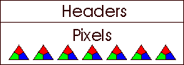
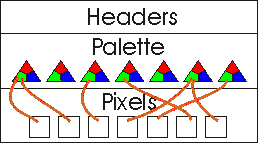
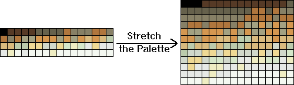
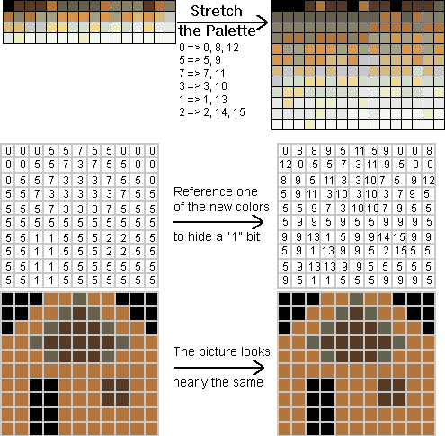
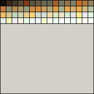
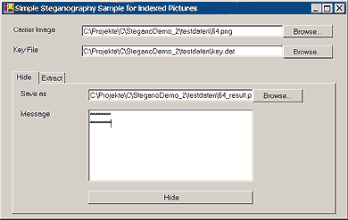
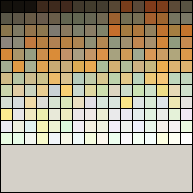

# {{ page.title }}

 [C# Quellcode - 11.9 Kb]()

## Worum geht es?

Diese Seite erkl&auml;rt, wie bin&auml;re Daten in einem Paletten-Bild (8 Bits/Pixel) versteckt werden k&ouml;nnen.
Die Methode ist eine ganz andere als die, die vorher f&uuml;r RBG (24 Bits/Pixel) Bitmaps verwendet wurde.
Dennoch kann es ganz n&uuml;tzlich sein, den [ersten Teil]()
gelesen zu haben, falls Dir die Unterschiede zwischen den beiden Arten von Bitmaps noch nicht bekannt sind.

## Erste Gedanken zu Index-Bildern...

Auf den vorhergehenden Seiten haben wir die Bits der geheimen Nachrichten in den
unteren Bits der Farbwerte versteckt.
In einer indizierten Bitmap stehen die Farbwerte nicht in den Pixeln, sondern in der Palette:

24 Bits pro Pixel, keine Palette
 

  
8 Bits pro Pixel, Palette von beliebiger Gr&ouml;&szlig;e (1 - 256)
 

Deine erste Idee k&ouml;nnte sein, die Nachricht in der Palette statt in den Pixeln zu verstecken.
Aber die Palette enth&auml;lt 256 oder weniger Farben, sie k&ouml;nnte nur ein paar Bytes verstecken.
Dieses Problem f&uuml;hrt zur zweiten Idee: Vergr&ouml;&szlig;ern wir die Palette doch, kopieren wird die Farbwerte!

Wenn wir die Palette verdoppeln, bekommen wir zwei alternative Indizes f&uuml;r jede Farbe.
Hey, das k&ouml;nnte eine bessere M&ouml;glichkeit sein! Eine Farbe aus den ersten zwei Zeilen zu referenzieren
k&ouml;nnte "Nachrichten-Bit ist 0" heissen, und die gleiche Farbe aus den unteren zwei Zeilen zu referenzieren
k&ouml;nnte "Nachrichten-Bit ist 1" bedeuten.
Aber wieder gibt es ein Problem: Eine Palette mit doppelten Farben ist Quatsch. Niemand w&uuml;rde
jemals so eine Palette verwenden. Eine verdoppelte Palette ist viel zu offensichtlich.

Also k&ouml;nnen wir die Palette nicht einfach kopieren, aber wir k&ouml;nnen Farben einf&uuml;gen, die ein wenig
von den vorhandenen Farben abweichen. Angenommen, wir f&uuml;gen f&uuml;r jede Farbe der Palette zwei &auml;hnliche (aber nicht gleiche)
Farbwerte ein:

Jetzt haben wir eine gestreckte Palette, aber das Vorhandensein einer versteckten Nachricht ist
genauso offensichtlich, weil nur jede dritte Farbe tats&auml;chlich verwendet wird.
Das ist &uuml;berhaupt kein Problem, wir m&uuml;ssen nur die Pixel &auml;ndern, so dass ein paar der Pixel,
die eine Original-Farbe referenziert haben, jetzt eine ihrer <i>Kopien</i> referenzieren.

Jetzt k&ouml;nnen wir etwas in den Pixeln verstecken. F&uuml;r ein Nachrichten-Bit von "1"
lassen wir ein Pixel auf die Original-Farbe verweisen, und f&uuml;r ein Nachrichten-Bit von "0"
lassen wir es auf eine der hinzugef&uuml;gten Farben verweisen.
Aber wie sollen wir die versteckte Nachricht wieder auslesen?
Wenn wir nur die gestreckte Palette kennen, wissen wir nicht, welche Farben von der
Original-Palette kopiert und welche hinzugef&uuml;gt wurden.

Gibt es eine M&ouml;glichkeit, einen Farbwert als "aus der Original-Palette" zu markieren?
Tja... da w&auml;ren die <i>niedrigsten Bits</i> in jeder Farbe. Dieser Name ist nicht ganz richtig.
Dank &uuml;blicher Bildschirme und schwacher menschlicher Augen verdient das unterste Bits einer Farbkomponente
den Namen <i>irrelevantes Bit</i>.
Indem wir das erste Bit einer Farbkomponente setzen oder nicht, k&ouml;nnen wir die Palette strecken und
jede Farbe als <i>kopiert</i> oder <i>neu</i> markieren:

## Wie man eine Palette un-optimiert

W&auml;hrend wir die neue Palette erstellen, m&uuml;ssen wir die kopierten und eingef&uuml;gten Farben mitschreiben,
weil wir sp&auml;ter die Pixel anpassen werden und daf&uuml;r in der Lage sein m&uuml;ssen, eine Original-Farbe (mit gerader
Blaukomponente) f&uuml;r eine "0", oder eine neue Farbe f&uuml;r eine "1" zu referenzieren.
Die Methode <code>StretchPalette</code> verwendet einen <code>Hashtable</code>, um jedem Index der alten Palette
die entsprechenden Indizes in der neuen Palette zuzuordnen.

<pre lang=cs>
/// &lt;summary&gt;
/// Erstellt eine gr&ouml;&szlig;ere Palette durch Duplizieren
/// und Ver&auml;ndern der Farben einer anderen Palette
/// &lt;/summary&gt;
/// &lt;param name="oldPalette"&gt;Die Palette, die getreckt werden soll&lt;/param&gt;
/// &lt;param name="maxPaletteSize"&gt;Anzahl der Farben in der neuen Palette&lt;/param&gt;
/// &lt;param name="newPalette"&gt;Erh&auml;lt die neuen Paletten-Eintr&auml;ge&lt;/param&gt;
/// &lt;param name="colorIndexToNewIndices"&gt;
/// Erh&auml;lt einen Hashtable mit den Original-Farben als Schl&uuml;ssel,
/// und den entsprechenden neuen Indizes als Werte
/// &lt;/param&gt;
public void StretchPalette(ColorPalette oldPalette, int maxPaletteSize,
  ref ArrayList newPalette, ref Hashtable colorIndexToNewIndices) {

  //collects the new palette entries
  newPalette = new ArrayList(maxPaletteSize);
  //maps each old index to the new indices
  colorIndexToNewIndices = new Hashtable( oldPalette.Entries.Length );

  Random random = new Random();
  byte indexInNewPalette;
  Color color, newColor;
  ColorIndexList colorIndexList;

  //repeat the loop if necessary
  while(newPalette.Count < maxPaletteSize){
          //loop over old palette entries
          for(byte n=0; n&lt;oldPalette.Entries.Length; n++){
            color = oldPalette.Entries[n]; //original color

            if(colorIndexToNewIndices.ContainsKey(n)){
              //this color from the original palette already has
              //one or more copies in the new palette
              colorIndexList = (ColorIndexList)colorIndexToNewIndices[n];
            }else{
              if(color.B%2 > 0){ //make even
                color = Color.FromArgb(color.R, color.G, color.B-1); }

                //add color
                indexInNewPalette = (byte)newPalette.Add(color);
                colorIndexList = new ColorIndexList(random);
                colorIndexList.Add(indexInNewPalette);
                colorIndexToNewIndices.Add(n, colorIndexList);
            }

            if(newPalette.Count < maxPaletteSize){
              //create a non-exact copy of the color
              newColor = GetSimilarColor(random, newPalette, color);

              if(newColor.B%2 == 0){ //make odd
                newColor = Color.FromArgb(
                    newColor.R, newColor.G, newColor.B+1);
              }

              //add the changed color to the new palette
              indexInNewPalette = (byte)newPalette.Add(newColor);
              //add the new index to the list of alternative indices
              colorIndexList.Add(indexInNewPalette);
            }

            //update the Hashtable
            colorIndexToNewIndices[n] = colorIndexList;

            if(newPalette.Count == maxPaletteSize){
              break; //the new palette is full - cancel
            }
    }
  }
}
</pre>

Falls Du den Code-Ausschnitt gelesen hast (andernfalls kannst du es nachholen, wenn Du den vollst&auml;ndigen
Quellcode heruntergeladen hast), hast Du wahrscheinlich die Methode <code>GetSimilarColor</code> bemerkt.
Diese Methode gibt eine Variation einer Farbe zur&uuml;ck:

<pre lang=cs>
private Color GetSimilarColor(Random random,
        ArrayList excludeColors,
        Color color) {

        Color newColor = color;
        int countLoops = 0, red, green, blue;
        do{
                red = GetSimilarColorComponent(random, newColor.R);
                green = GetSimilarColorComponent(random, newColor.G);
                blue = GetSimilarColorComponent(random, newColor.B);
                newColor = Color.FromArgb(red, green, blue);
                countLoops++;
        //make sure that there are no duplicate colors
        }while(excludeColors.Contains(newColor)&&(countLoops&lt;10));

        return newColor;
}

private byte GetSimilarColorComponent(Random random, byte colorValue){
        if(colorValue < 128){
                colorValue = (byte)(colorValue *
                        (1 + random.Next(1,8)/(float)100) );
        }else{
                colorValue = (byte)(colorValue /
                        (1 + random.Next(1,8)/(float)100) );
        }
        return colorValue;
}
</pre>

Jetzt haben wir eine neue Palette, und eine Schl&uuml;ssel/Wert-Tabelle, um alte Indizes
ihren neuen Indizes zuzuordnen.
Der n&auml;chste Schritt ist endlich, die Bits der Nachricht zu verstecken, w&auml;hrend das Bild kopiert wird.
<code>System.Drawing.Image</code> hat eine Eigenschaft <code>Palette</code>
vom Typ <code>ColorPalette</code>. Das ist eine der restriktivsten Klassen, ide ich je gesehen habe.
Sie hat zwei Eigenschaften, <code>Flags</code> und <code>Entries</code> -
beide sind schreibgesch&uuml;tzt. <code>ColorPalette</code> erlaubt es, die Farben der orhandenen Palette zu
&auml;ndern, aber wir k&ouml;nnen keine Farben einf&uuml;gen.
Ich wollte nicht stundenlang nach eine sauberen .NET L&ouml;sung suchen, eine neue Bitmap zu schreiben ist einfacher:

<pre lang=cs>
/// &lt;summary&gt;
/// Erstellt ein Bild mit gestreckter Palette,
/// konvertiert die Pixel des Original-Bildes f&uuml;r die neue Palette,
/// und versteckt eine Nachricht in den konvertierten Pixeln
/// &lt;/summary&gt;
/// &lt;param name="bmp"&gt;Original-Bilde&lt;/param&gt;
/// &lt;param name="palette"&gt;Neue Palette&lt;/param&gt;
/// &lt;param name="colorIndexToNewIndices"&gt;
/// Hashtable der jedem Index der Original-Palette
/// eine Liste von Indizes in der neuen Palette zuordnet
/// &lt;/param&gt;
/// &lt;param name="messageStream"&gt;Geheime Nachricht&lt;/param&gt;
/// &lt;param name="keyStream"&gt;
/// Schl&uuml;ssel der die Entfernungen zwischen zwei zum
/// Verstecken verwendeten Pixeln angibt
/// &lt;/param&gt;
/// &lt;returns&gt;Das neue Bild&lt;/returns&gt;
private Bitmap CreateBitmap(
  Bitmap bmp, ArrayList palette,
  Hashtable colorIndexToNewIndices,
  Stream messageStream, Stream keyStream) {

  //lock the original bitmap
  BitmapData bmpData = bmp.LockBits(
    new Rectangle(0,0,bmp.Width, bmp.Height),
    ImageLockMode.ReadWrite,
    PixelFormat.Format8bppIndexed);

  //size of the image data in bytes
  int imageSize = (bmpData.Height * bmpData.Stride)+(palette.Count * 4);

  //copy all pixels
  byte[] pixels = new byte[imageSize];
  Marshal.Copy(bmpData.Scan0, pixels, 0, (bmpData.Height*bmpData.Stride));

  int messageByte=0, messageBitIndex=7;
  bool messageBit;
  ColorIndexList newColorIndices;
  Random random = new Random();

  //index of the next pixel that's going to hide one bit
  int nextUseablePixelIndex = GetKey(keyStream);

  //loop over the pixels
  for(int pixelIndex=0; pixelIndex&lt;pixels.Length; pixelIndex++){

    //get the list of new color indices for the current pixel
    newColorIndices=(ColorIndexList)colorIndexToNewIndices[pixels[pixelIndex]];

    if((pixelIndex &lt; nextUseablePixelIndex) || messageByte &lt; 0){
    //message complete or this pixel has to be skipped - use a random color
      pixels[pixelIndex] = newColorIndices.GetIndex();
    }else{
      //message not complete yet

      if(messageBitIndex == 7){
        //one byte has been hidden - proceed to the next one
        messageBitIndex = 0;
        messageByte = messageStream.ReadByte();
      }else{
        messageBitIndex++; //next bit
      }

      //get a bit out of the current byte
      messageBit = (messageByte & (1 &lt;&lt; messageBitIndex)) &gt; 0;
      //get the index of a similar color in the new palette
      pixels[pixelIndex] = newColorIndices.GetIndex(messageBit);
      nextUseablePixelIndex += GetKey(keyStream);
    }
  }

  //Jetzt haben wir die Palette und die neuen Pixel.
  //Genug Informationen um die Bitmap zu schreiben !
</b>
  BinaryWriter bw = new BinaryWriter( new MemoryStream() );

  //write bitmap file header
  //...
  //...

  //write bitmap info header
  //...
  //...

  //write palette
  foreach(Color color in palette){
    bw.Write((UInt32)color.ToArgb());
  }

  //write pixels
  bw.Write(pixels);

  bmp.UnlockBits(bmpData);

  Bitmap newImage = (Bitmap)Image.FromStream(bw.BaseStream);
  newImage.RotateFlip(RotateFlipType.RotateNoneFlipY);

  bw.Close();
  return newImage;
}
</pre>

## Eine versteckte Nachricht auslesen

Eine versteckte Nachricht auszulesen ist viel einfacher, als sie zu verstecken.
Es gibt nur eine Palette, und wir m&uuml;ssen uns nicht mit alten und neuen Indizes herumschlagen.
Wir verwenden einfach den Verteilungsschl&uuml;ssel um ein Tr&auml;ger-Pixel zu finden,
pr&uuml;fen die referenzierte Farbe nach gerader oder ungerade Blaukomponente,
speichern das gefundene Bit (welches <i>color.B % 2 > 0</i> ist)
und machen mit dem n&auml;chsten Pixel weiter, bis dsie Nachricht vollst&auml;ndig ist:

<pre lang=cs>
public void Extract(Stream messageStream, Stream keyStream){
  //load the carrier image
  Bitmap bmp = new Bitmap(sourceFileName);
  BitmapData bmpData = bmp.LockBits(
    new Rectangle(0,0,bmp.Width, bmp.Height),
    ImageLockMode.ReadWrite,
    PixelFormat.Format8bppIndexed);

  //copy all pixels
  byte[] pixels = new byte[bmpData.Stride*bmpData.Height];
  Marshal.Copy(bmpData.Scan0, pixels, 0, pixels.Length);

  Color[] palette = bmp.Palette.Entries;
  byte messageByte=0, messageBitIndex=0, pixel=0;
  int messageLength=0, pixelIndex=0;

  //read pixels until the message is complete
  while((messageLength==0) || (messageStream.Length &lt; messageLength)){
    //locate the next pixel that carries a hidden bit
    pixelIndex += GetKey(keyStream);
    pixel = pixels[pixelIndex];

    if( (palette[pixel].B % 2) == 1 ){
      //odd blue-component: message-bit was "1"
      messageByte += (byte)(1 &lt;&lt; messageBitIndex);
    } //else: messageBit was "0", nothing to do

    if(messageBitIndex == 7){ //a byte is complete
      //save and reset messageByte, reset messageBitIndex
      messageStream.WriteByte(messageByte);
      messageBitIndex = 0;
      messageByte = 0;

      if((messageLength == 0)&&(messageStream.Length==4)){
        //message's length has been read
        messageStream.Seek(0, SeekOrigin.Begin);
        messageLength = new BinaryReader(messageStream).ReadInt32();
        messageStream.SetLength(0);
      }
    }else{
      messageBitIndex++; //next bit
    }
  }

  //release the carrier bitmap
  bmp.UnlockBits(bmpData);
  bmp.Dispose();
}
</pre>

## Beispiel

Die Bilder d&uuml;rfen nur 128 oder weniger Farben enthalten, sonst k&ouml;nnten wir nicht
f&uuml;r jede Farbe einen alternativen Paletteneintrag hinzuf&uuml;gen.
F&uuml;r eine ernsthafte Einschr&auml;nkung halte ich das jedoch nicht,
denn die meisten indizierten GIF oder PNG Bilder haben weniger Farben.
Wenn alle 256 Farben f&uuml;r ein Bild gebraucht werden, ist ein Format mit 24 Bits/Pixel
besser geeignet.
Aber jetzt schauen wir endlich zu, wie sich die Palette ver&auml;ndert...

Das ist Sternchen Kanari, unser Modell:

Hier sind das gleiche Foto als indiziertes PNG mit 64 Farben und seine Palette:

Starte die Demo-Anwendung, w&auml;hle das Bild als Tr&auml;ger und irgendeine andere Datei als Schl&uuml;ssel...

...und klick <i>Hide</i>. Das generierte Bild enth&auml;lt eine Palette mit 192 Farben,
und sieht nicht viel anders aus, obwohl alle Farben verwendet werden und keine sich wiederholt.

Das generierte Bild das Du hier siehst enth&auml;lt eine versteckte Nachricht von 42 W&ouml;rtern,
die mit der Demo-Anwendung ausgelesen werden kann.
Der Schl&uuml;ssel zur Nachricht steckt irgendwo im f&uuml;nften Bild dieser Seite.
Du brauchst einen Hexadezimal-Editor, um seine 11 Bytes in eine Schl&uuml;ssel-Datei zu tippen...

